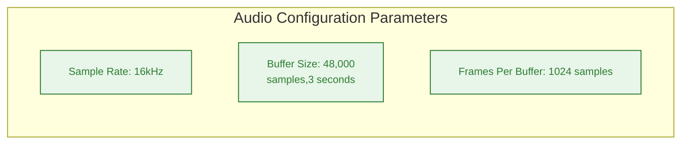
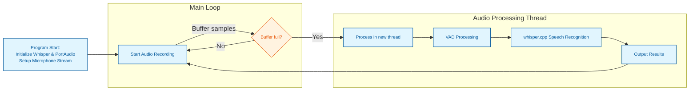

# whisper.cpp/examples/cli




This is the main example demonstrating most of the functionality of the Whisper model.
It can be used as a reference for using the `whisper.cpp` library in other projects.

```
./build/bin/whisper-cli -h

usage: ./build/bin/whisper-cli [options] file0 file1 ...
supported audio formats: flac, mp3, ogg, wav

options:
  -h,        --help              [default] show this help message and exit
  -t N,      --threads N         [4      ] number of threads to use during computation
  -p N,      --processors N      [1      ] number of processors to use during computation
  -ot N,     --offset-t N        [0      ] time offset in milliseconds
  -on N,     --offset-n N        [0      ] segment index offset
  -d  N,     --duration N        [0      ] duration of audio to process in milliseconds
  -mc N,     --max-context N     [-1     ] maximum number of text context tokens to store
  -ml N,     --max-len N         [0      ] maximum segment length in characters
  -sow,      --split-on-word     [false  ] split on word rather than on token
  -bo N,     --best-of N         [5      ] number of best candidates to keep
  -bs N,     --beam-size N       [5      ] beam size for beam search
  -ac N,     --audio-ctx N       [0      ] audio context size (0 - all)
  -wt N,     --word-thold N      [0.01   ] word timestamp probability threshold
  -et N,     --entropy-thold N   [2.40   ] entropy threshold for decoder fail
  -lpt N,    --logprob-thold N   [-1.00  ] log probability threshold for decoder fail
  -nth N,    --no-speech-thold N [0.60   ] no speech threshold
  -tp,       --temperature N     [0.00   ] The sampling temperature, between 0 and 1
  -tpi,      --temperature-inc N [0.20   ] The increment of temperature, between 0 and 1
  -debug,    --debug-mode        [false  ] enable debug mode (eg. dump log_mel)
  -tr,       --translate         [false  ] translate from source language to english
  -di,       --diarize           [false  ] stereo audio diarization
  -tdrz,     --tinydiarize       [false  ] enable tinydiarize (requires a tdrz model)
  -nf,       --no-fallback       [false  ] do not use temperature fallback while decoding
  -otxt,     --output-txt        [false  ] output result in a text file
  -ovtt,     --output-vtt        [false  ] output result in a vtt file
  -osrt,     --output-srt        [false  ] output result in a srt file
  -olrc,     --output-lrc        [false  ] output result in a lrc file
  -owts,     --output-words      [false  ] output script for generating karaoke video
  -fp,       --font-path         [/System/Library/Fonts/Supplemental/Courier New Bold.ttf] path to a monospace font for karaoke video
  -ocsv,     --output-csv        [false  ] output result in a CSV file
  -oj,       --output-json       [false  ] output result in a JSON file
  -ojf,      --output-json-full  [false  ] include more information in the JSON file
  -of FNAME, --output-file FNAME [       ] output file path (without file extension)
  -np,       --no-prints         [false  ] do not print anything other than the results
  -ps,       --print-special     [false  ] print special tokens
  -pc,       --print-colors      [false  ] print colors
  -pp,       --print-progress    [false  ] print progress
  -nt,       --no-timestamps     [false  ] do not print timestamps
  -l LANG,   --language LANG     [en     ] spoken language ('auto' for auto-detect)
  -dl,       --detect-language   [false  ] exit after automatically detecting language
             --prompt PROMPT     [       ] initial prompt (max n_text_ctx/2 tokens)
  -m FNAME,  --model FNAME       [models/ggml-base.en.bin] model path
  -f FNAME,  --file FNAME        [       ] input audio file path
  -oved D,   --ov-e-device DNAME [CPU    ] the OpenVINO device used for encode inference
  -dtw MODEL --dtw MODEL         [       ] compute token-level timestamps
  -ls,       --log-score         [false  ] log best decoder scores of tokens
  -ng,       --no-gpu            [false  ] disable GPU
  -fa,       --flash-attn        [false  ] flash attention
  -sns,      --suppress-nst      [false  ] suppress non-speech tokens
  --suppress-regex REGEX         [       ] regular expression matching tokens to suppress
  --grammar GRAMMAR              [       ] GBNF grammar to guide decoding
  --grammar-rule RULE            [       ] top-level GBNF grammar rule name
  --grammar-penalty N            [100.0  ] scales down logits of nongrammar tokens
```

Key buffer parameters:
- **Sample Rate**: 16,000 Hz (default)
- **Buffer Size**: 48,000 samples (3 seconds of audio)
- **Frames Per Buffer**: 1,024 samples
- **Processing**: When buffer is full, a new thread processes the audio while main thread continues capturing

The callback function stores audio samples in both a continuous recording buffer and a fixed-size processing buffer. When the processing buffer is filled, the audio is analyzed by Whisper in a separate thread to maintain real-time operation.
